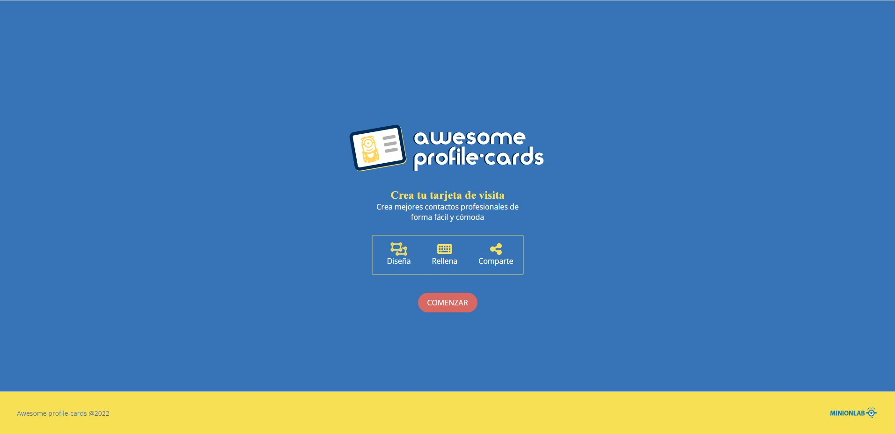
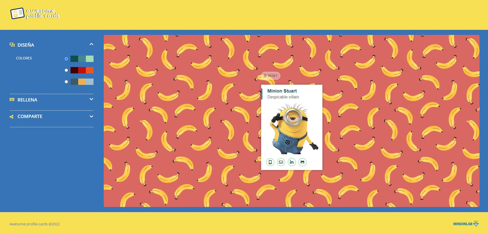
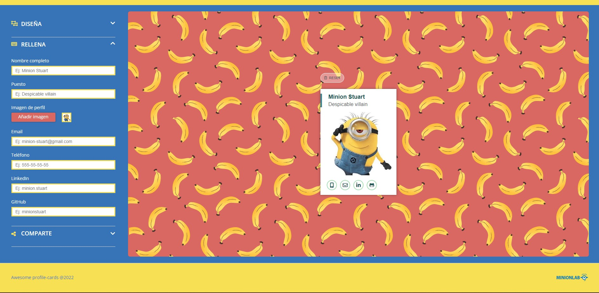
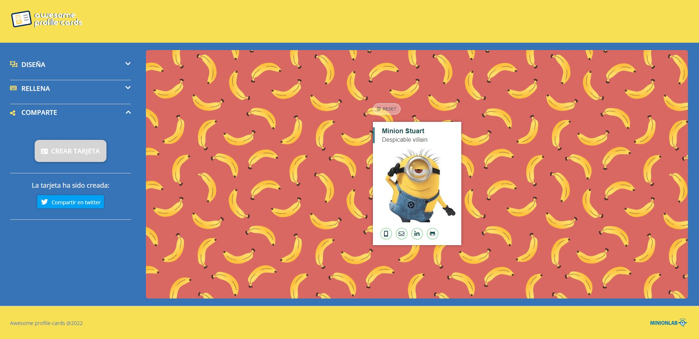

# Welcome to Awesome Profile Cards Minion Edition!

Hello everyone! This is **Awesome Profile Cards Minion Edition**, a project based on a migration of legacy code from JavaScript to React where you will be able to create a virtual card to show your professional profile as a developer to the whole world. Come on in and design your card now!

## What can you do on our website?

With a fun theme based on Minion characters, you will be able to create your own professional card following these simple steps:

1. Choose the colours of your card based on 3 different palettes.

2. Add all the relevant information about your profile, including links to your different social networks (Email, Linkedin, Twitter and GitHub).

3. Share via link and twitter your card!

## 🛠 Used Technologies:

This page is layout and dynamised through **HTML**, **SCSS** and **React JS** and the Server and Database have been developed with **SQLite** and **Node js (Express js)**

### Authors:

- [@marialapc](https://github.com/marialapc)
- [@Yarap07](https://github.com/Yarap07)
- [@NOEMIYUEN](https://github.com/NOEMIYUEN)
- [@MariaSJ](https://github.com/MariaSJ)
